# 🌊 FLOWCHART SISTEM RIVANA (WATER EVALUATION AND PLANNING)

## ALUR PROGRAM UTAMA

```mermaid
flowchart TB
    Start([MULAI PROGRAM]) --> Menu{Pilih Cara Jalankan?}
    
    Menu -->|Otomatis/Perintah| ArgParse[Ambil Data dari Perintah:<br/>Longitude, Latitude,<br/>Tanggal Mulai & Akhir]
    Menu -->|Manual| Interactive[Tampilkan Pilihan:<br/>1. Otomatis Default<br/>2. Input Sendiri<br/>3. Custom]
    
    ArgParse --> SetParams[Siapkan Data Awal]
    Interactive --> InputParams[Terima Input dari User]
    InputParams --> SetParams
    
    SetParams --> Main[Mulai Program Utama]
    
    Main --> Init[Hubungkan ke Google Earth Engine]
    Init --> FetchGEE[Ambil Data Satelit:<br/>Curah Hujan, Suhu,<br/>Kehijauan Tanaman, Kelembaban Tanah]
    
    FetchGEE --> EstimateET[Hitung Penguapan Air<br/>Menggunakan ML]
    EstimateET --> FetchMorph[Ambil Data Bentuk Bumi:<br/>Ketinggian, Kemiringan,<br/>Arah Aliran Air]
    
    FetchMorph --> SaveRaw[Simpan Data Mentah:<br/>File CSV & JSON]
    
    SaveRaw --> TrainLabel[Latih ML Pembuat Label<br/>Berdasarkan Hukum Fisika]
    TrainLabel --> GenLabels[Buat Label Otomatis:<br/>Air Larian, Air Meresap,<br/>Rembesan, Aliran Dasar,<br/>Tampungan Air]
    
    GenLabels --> TrainModels[Latih 12 Model ML<br/>Untuk Berbagai Analisis]
    
    TrainModels --> Module1[1️⃣ ML Pergerakan Tanah<br/>Lumpur di Air<br/>Lumpur di Dasar<br/>Erosi]
    TrainModels --> Module2[2️⃣ ML Simulasi Air<br/>Hujan jadi Aliran<br/>Resapan ke Tanah]
    TrainModels --> Module3[3️⃣ ML Kebutuhan Air<br/>Pembagian Air<br/>Pemenuhan Kebutuhan]
    TrainModels --> Module4[4️⃣ ML Prediksi Bencana<br/>Risiko Banjir & Kekeringan]
    TrainModels --> Module5[5️⃣ ML Bendungan<br/>Saran Operasi Bendungan]
    TrainModels --> Module6[6️⃣ ML Peramal<br/>Prediksi 30 Hari]
    TrainModels --> Module7[7️⃣ ML Hak Air<br/>Prioritas Pembagian Air]
    TrainModels --> Module8[8️⃣ ML Jaringan Pipa<br/>Distribusi Air]
    TrainModels --> Module9[9️⃣ ML Ekonomi<br/>Analisis Biaya-Manfaat]
    TrainModels --> Module10[🔟 ML Kualitas Air<br/>pH, Oksigen, Kebersihan]
    TrainModels --> Module11[1️⃣1️⃣ ML Ekologi<br/>Habitat Ikan & Tanaman]
    TrainModels --> Module12[1️⃣2️⃣ ML Sungai<br/>Perubahan Bentuk Sungai]
    
    Module1 --> Simulate
    Module2 --> Simulate
    Module3 --> Simulate
    Module4 --> Simulate
    Module5 --> Simulate
    Module6 --> Simulate
    Module7 --> Simulate
    Module8 --> Simulate
    Module9 --> Simulate
    Module10 --> Simulate
    Module11 --> Simulate
    Module12 --> Simulate
    
    Simulate[Jalankan Simulasi Lengkap] --> Forecast[Buat Ramalan 30 Hari]
    
    Forecast --> Validate[Cek Akurasi Model<br/>Hitung Tingkat Kesalahan]
    
    Validate --> Baseline[Bandingkan dengan<br/>Metode Tradisional:<br/>Manual vs AI]
    
    Baseline --> WaterBalance[Cek Keseimbangan Air<br/>Air Masuk = Air Keluar?]
    
    WaterBalance --> Viz[Buat 8 Grafik<br/>Dashboard Visual]
    
    Viz --> SaveResults[Simpan Semua Hasil:<br/>CSV + JSON + Gambar]
    
    SaveResults --> Summary[Tampilkan Ringkasan<br/>Hasil Analisis]
    
    Summary --> End([SELESAI])
    
    style Start fill:#4CAF50,color:#fff
    style End fill:#f44336,color:#fff
    style Main fill:#2196F3,color:#fff
    style TrainModels fill:#FF9800,color:#fff
    style Validate fill:#9C27B0,color:#fff
    style SaveResults fill:#00BCD4,color:#fff
```



---

## DETAIL ALUR DATA PROCESSING

```mermaid
flowchart LR
    subgraph Input["📥 DATA MASUK"]
        GEE[Data Satelit<br/>Google Earth Engine]
        Location[Titik Lokasi<br/>Longitude & Latitude]
        DateRange[Periode Waktu<br/>Tanggal Mulai & Akhir]
    end
    
    subgraph Processing["⚙️ PROSES DATA"]
        direction TB
        Raw[Bersihkan Data Mentah]
        PhysicsLabel[Buat Label Awal<br/>Pakai Rumus Fisika]
        MLLabel[Sempurnakan Label<br/>Pakai ML]
        
        Raw --> PhysicsLabel
        PhysicsLabel --> MLLabel
    end
    
    subgraph MLModels["🤖 12 MODEL ML"]
        direction TB
        Hydro[Model Hidrologi]
        Sediment[Model Sedimen]
        Supply[Model Kebutuhan]
        Forecast[Model Peramalan]
        Quality[Model Kualitas]
        Ecology[Model Ekologi]
        
        Hydro -.-> Sediment
        Hydro -.-> Supply
        Hydro -.-> Forecast
        Hydro -.-> Quality
        Hydro -.-> Ecology
    end
    
    subgraph Validation["✅ VALIDASI"]
        direction TB
        Metrics[Ukur Akurasi]
        Baseline[Bandingkan Metode]
        WB[Cek Keseimbangan Air]
        
        Metrics --> Baseline
        Baseline --> WB
    end
    
    subgraph Output["📤 HASIL AKHIR"]
        direction TB
        CSV[File Excel CSV<br/>Data Hasil Simulasi]
        JSON[File JSON<br/>Data Teknis & Validasi]
        PNG[File Gambar PNG<br/>Grafik & Dashboard]
        
        CSV ~~~ JSON
        JSON ~~~ PNG
    end
    
    Input --> Processing
    Processing --> MLModels
    MLModels --> Validation
    Validation --> Output
```



---

## ALUR ML LABEL GENERATOR


---

## ALUR WATER BALANCE VALIDATION

```mermaid
flowchart TB
    Start([Mulai Cek Air]) --> Define[Tentukan Rumus:<br/>Air Masuk = Air Keluar + Perubahan Tampungan]
    
    Define --> Input[Hitung Air Masuk:<br/>Total Hujan]
    
    Input --> Output[Hitung Air Keluar:<br/>Penguapan + Larian + Aliran Dasar]
    
    Output --> Storage[Hitung Perubahan Tampungan:<br/>Bendungan + Tanah + Air Tanah]
    
    Storage --> Residual[Hitung Selisih:<br/>Air Masuk - Air Keluar - Perubahan]
    
    Residual --> Error{Selisih < 5%?}
    
    Error -->|Ya| Valid[✅ Keseimbangan Air Valid]
    Error -->|Tidak| Warning[⚠️ Perlu Perbaikan Model]
    
    Valid --> Monthly[Analisis Bulanan<br/>Cek Per Bulan]
    Warning --> Monthly
    
    Monthly --> Indices[Hitung Indikator:<br/>Rasio Larian<br/>Rasio Penguapan<br/>Indeks Keseimbangan<br/>Indeks Kekeringan]
    
    Indices --> Report[Buat Laporan]
    
    Report --> End([Selesai])
    
    style Start fill:#4CAF50,color:#fff
    style End fill:#2196F3,color:#fff
    style Valid fill:#8BC34A,color:#fff
    style Warning fill:#FF9800,color:#fff
```



---

## ALUR 12 ML MODULES (MACHINE LEARNING)


---

## ALUR VISUALISASI


---

## FILE OUTPUT STRUCTURE

```
results/
└── [session-id]/
    ├── 📄 CSV FILES (Data)
    │   ├── GEE_Raw_Data.csv                    # Raw satellite data
    │   ├── RIVANA_Hasil_Complete.csv           # Complete simulation results
    │   ├── RIVANA_Hasil_Simulasi.csv           # Simulation summary
    │   ├── RIVANA_Monthly_WaterBalance.csv     # Monthly water balance
    │   ├── RIVANA_Prediksi_30Hari.csv         # 30-day forecast
    │   └── RIVANA_WaterBalance_Indices.csv    # Water balance indices
    │
    ├── 📊 JSON FILES (Metadata & Validation)
    │   ├── GEE_Data_Metadata.json              # Satellite data metadata
    │   ├── params.json                         # Input parameters
    │   ├── RIVANA_Model_Validation_Complete.json
    │   ├── RIVANA_WaterBalance_Validation.json
    │   ├── RIVANA_Baseline_Comparison.json
    │   └── model_validation_report.json
    │
    └── 🖼️ PNG FILES (Visualizations)
        ├── RIVANA_Dashboard.png                # Main dashboard
        ├── RIVANA_Enhanced_Dashboard.png       # Enhanced metrics
        ├── RIVANA_Water_Balance_Dashboard.png  # Water balance
        ├── RIVANA_Morphometry_Summary.png      # Morphometry
        ├── RIVANA_Morphology_Ecology_Dashboard.png
        ├── RIVANA_Baseline_Comparison.png      # Performance
        ├── RIVANA_Supply_Demand_Dashboard.png  # Water allocation
        └── RIVANA_River_Network_Map.html       # Interactive map
```

---

## DETAIL RUMUS & MODEL ML PER SUBPROSES

### 🔬 **1. ML PEMBUAT LABEL (MLLabelGenerator)**
**Model:** Neural Network (Dense + Dropout)
- **Input:** 5 fitur (rainfall, ET, temperature, NDVI, soil_moisture)
- **Output:** 7 label (runoff, infiltration, percolation, baseflow, reservoir, soil_storage, aquifer)
- **Arsitektur:** Dense(64) → Dropout(0.3) → Dense(48) → Dropout(0.2) → Dense(32) → Dense(7)

**Rumus Physics-Based (Initial Labels):**
```
1. Runoff (Curve Number Method):
   S = (25400 / CN) - 254
   Q = ((P - 0.2S)²) / (P + 0.8S)  jika P > 0.2S

2. Infiltration (Green-Ampt Simplified):
   f = min(P - Q, Ks/24)
   
3. Percolation:
   perc = infiltration × soil_moisture × 0.3

4. Baseflow (Recession Curve):
   Q_base(t) = k × Q_base(t-1) + perc × 0.1
   
5. Storage (Cumulative):
   Reservoir = cumsum(runoff × 0.12)
   Soil = cumsum(infiltration × 0.6 - ET × 0.4)
   Aquifer = cumsum(percolation × 0.5 - baseflow)
```

---

### 💧 **2. ML PENGHITUNG PENGUAPAN (MLETEstimator)**
**Model:** Random Forest Regressor (100 trees)
- **Input:** 3 fitur (temperature, NDVI, soil_moisture)
- **Output:** Evapotranspiration (mm/day)
- **Training:** Penman-Monteith simplified sebagai ground truth

**Rumus Penman-Monteith (Simplified):**
```
ET₀ = 0.0023 × (T_mean + 17.8) × √(T_max - T_min) × R_a
ET_actual = ET₀ × Kc
Kc = 0.5 + (NDVI × 0.8) × soil_moisture
```

---

### 🏔️ **3. ML PERGERAKAN TANAH (MLSedimentTransport)**
**Model:** Neural Network
- **Input:** 6 fitur (rainfall, runoff, ET, NDVI, soil_moisture, temperature)
- **Output:** 4 target (suspended_sediment, bedload, erosion_rate, deposition_rate)
- **Arsitektur:** Dense(64) → Dropout(0.3) → Dense(48) → Dropout(0.2) → Dense(32) → Dense(4)

**Rumus USLE (Universal Soil Loss Equation):**
```
A = R × K × LS × C × P

Dimana:
R = Rainfall erosivity = rainfall_energy × rainfall × 0.5
K = Soil erodibility = 0.3 (dari config)
LS = Slope factor = 1.5 × (sin(slope) / 0.0896)^0.6
C = Cover factor = exp(-2 × NDVI)
P = Practice factor = 1.0

Sediment Transport:
- Suspended = erosion × SDR × (stream_power/100)^0.5
- Bedload = 8 × (shear_stress - critical_shear)^1.5
- Deposition = suspended × 0.3 (saat velocity rendah)
```

---

### 🌊 **4. ML SIMULASI AIR (MLHydroSimulator)**
**Model:** LSTM (Long Short-Term Memory)
- **Input Sequence:** 14 hari (look_back) × 7 fitur
- **Output:** 7 komponen hidrologi
- **Arsitektur:** LSTM(64, return_sequences=True) → Dropout(0.3) → LSTM(48) → Dropout(0.2) → Dense(32) → Dense(7)

**Physics-Informed Loss Function:**
```
Loss_total = MSE + λ × WB_penalty

Water Balance Penalty:
WB_error = |Input - Output - ΔStorage|
WB_penalty = mean(WB_error²)

Dimana:
Input = Rainfall
Output = ET + Runoff + Baseflow
ΔStorage = ΔReservoir + ΔSoil + ΔAquifer
```

---

### 🚰 **5. ML KEBUTUHAN AIR (MLSupplyDemand)**
**Model:** Multi-Output Neural Network
- **Input:** 7 fitur (runoff, baseflow, reservoir, aquifer, demand_domestic, demand_agriculture, demand_industry)
- **Output:** 7 target (supply_domestic, supply_agriculture, supply_industry, unmet_domestic, unmet_agriculture, unmet_industry, supply_ratio)
- **Arsitektur:** Dense(32) → Dropout(0.2) → Dense(24) → Dropout(0.1) → Dense(7 outputs)

**Proses Pembagian Air:**
```
1. Hitung Total Air Tersedia:
   Available = Runoff + Baseflow + Reservoir × 0.3 + Aquifer × 0.1

2. Tentukan Prioritas Kebutuhan:
   Priority: Domestik (100%) → Pertanian (80%) → Industri (60%)

3. Alokasi Air Per Sektor:
   Supply = min(Demand × Priority, Available)

4. Hitung Kekurangan:
   Unmet = Demand - Supply

5. Supply Ratio (Efisiensi):
   Ratio = Total_Supply / Total_Demand × 100%
```

---

### ⚠️ **6. ML PREDIKSI BENCANA (MLFloodDroughtPredictor)**
**Model:** Gradient Boosting Classifier
- **Input:** 7 fitur hidrologi + 12 indikator risiko
- **Output:** 4 klasifikasi (flood_risk, drought_risk, severity, warning_level)
- **Parameters:** 100 estimators, max_depth=5, learning_rate=0.1

**Indikator Risiko:**
```
1. Flood Risk Index (FRI):
   FRI = (Runoff_current / Runoff_mean) × (Rainfall_7day / Rainfall_mean)
   
   Klasifikasi:
   - FRI < 1.5: Normal (0)
   - 1.5 ≤ FRI < 2.5: Warning (1)
   - 2.5 ≤ FRI < 4.0: Alert (2)
   - FRI ≥ 4.0: Emergency (3)

2. Drought Risk Index (DRI):
   DRI = (ET_cumulative - Rainfall_cumulative) / Rainfall_mean
   
   Klasifikasi:
   - DRI < 0.5: Normal (0)
   - 0.5 ≤ DRI < 1.0: Moderate (1)
   - 1.0 ≤ DRI < 2.0: Severe (2)
   - DRI ≥ 2.0: Extreme (3)

3. Severity Score:
   Severity = max(FRI, DRI) × (1 + soil_deficit × 0.2)

4. Warning Level:
   0: Normal, 1: Advisory, 2: Watch, 3: Warning, 4: Emergency
```

---

### 🏗️ **7. ML SARAN BENDUNGAN (MLReservoirAdvisor)**
**Model:** Neural Network dengan Constraint Layer
- **Input:** 8 fitur (reservoir_level, inflow, demand, rainfall_forecast, flood_risk, drought_risk, season, day_of_year)
- **Output:** 5 rekomendasi (release_rate, storage_target, spill_risk, safety_status, action)
- **Arsitektur:** Dense(48) → Dense(32) → Dense(24) → Dense(5)

**Aturan Operasi:**
```
1. Zona Operasi Bendungan:
   - Dead Storage: 0-20% kapasitas
   - Conservation: 20-70% kapasitas
   - Flood Control: 70-90% kapasitas
   - Emergency: 90-100% kapasitas

2. Release Rate (Laju Pelepasan):
   if level < 30%:
       release = min(inflow, demand × 0.8)  # Konservasi
   elif 30% ≤ level < 70%:
       release = demand  # Normal
   elif 70% ≤ level < 90%:
       release = max(demand, inflow × 0.8)  # Preventif
   else:
       release = max(inflow, spill_capacity)  # Darurat

3. Storage Target (Target Tampungan):
   Target = f(musim, curah_hujan_forecast, kebutuhan)
   - Musim Hujan: 60-70% (siap banjir)
   - Musim Kemarau: 80-90% (cadangan)

4. Safety Status:
   - Safe: level < 85%
   - Caution: 85% ≤ level < 95%
   - Critical: level ≥ 95%

5. Recommended Action:
   - Hold: Tahan air (kekeringan)
   - Release: Lepas normal
   - Emergency Release: Lepas maksimal (banjir)
```

---

### 🔮 **8. ML PERAMALAN (MLForecaster)**
**Model:** Sequence-to-Sequence LSTM (Encoder-Decoder)
- **Input:** 30 hari historis × 7 fitur
- **Output:** 30 hari prediksi × 7 fitur
- **Arsitektur:**
```
Encoder:
  LSTM(64, return_sequences=True)
  LSTM(48, return_state=True)

Decoder:
  RepeatVector(30)  # 30 hari ke depan
  LSTM(48, return_sequences=True)
  LSTM(64, return_sequences=True)
  TimeDistributed(Dense(7))
```

**Proses Peramalan:**
```
1. Encoder: Baca pola 30 hari terakhir
2. Decoder: Generate prediksi 30 hari ke depan
3. Teacher Forcing: Latih dengan data real
4. Inference: Prediksi autoregressive

Confidence Interval:
  CI_95% = prediction ± 1.96 × std_error
```

---

### ⚖️ **9. ML HAK AIR (MLWaterRights)**
**Model:** Multi-Task Neural Network
- **Input:** 10 fitur (available_water, 3×demands, 3×priorities, season, legal_rights, historical_allocation)
- **Output:** 6 target (3×allocations, 3×adjusted_priorities)
- **Arsitektur:** Shared Dense(32) → 2 branches → Dense(3) each

**Sistem Prioritas Dinamis:**
```
1. Base Priority (Prioritas Dasar):
   - Domestik: 100 (mutlak)
   - Pertanian: 80 (musiman)
   - Industri: 60 (fleksibel)

2. Dynamic Adjustment (Penyesuaian):
   Adjusted_Priority = Base × Scarcity_Factor × Legal_Factor
   
   Scarcity_Factor = 1 + (1 - Available/Normal) × 0.5
   Legal_Factor = Historical_Rights / Max_Rights

3. Allocation Algorithm:
   Step 1: Allocate_by_priority(sorted_users)
   Step 2: Check_if_demand_met()
   Step 3: Redistribute_surplus()
   
4. Fairness Constraint:
   Gini_Coefficient < 0.4 (Distribusi merata)
   
5. Output:
   - Final_Allocation (m³/day)
   - Priority_Score (0-100)
   - Satisfaction_Ratio (%)
```

---

### 🔗 **10. ML JARINGAN DISTRIBUSI (MLSupplyNetwork)**
**Model:** Graph Neural Network (GNN)
- **Input:** Network topology (nodes + edges) + flow data
- **Output:** Optimal flow per edge + node pressure
- **Arsitektur:** GraphConv(32) → GraphConv(24) → Dense(16) → Output

**Optimasi Jaringan:**
```
1. Network Graph:
   Nodes: Source (waduk), Junction (simpang), Demand (user)
   Edges: Pipes (pipa) dengan kapasitas & resistance

2. Flow Optimization:
   Minimize: Total_Energy_Loss + Pumping_Cost
   
   Subject to:
   - Mass Conservation: Σ(flow_in) = Σ(flow_out) at each node
   - Pressure Constraint: P_min ≤ P_node ≤ P_max
   - Capacity Constraint: 0 ≤ Q_pipe ≤ Q_max

3. Hazen-Williams Equation:
   h_f = 10.67 × L × Q^1.852 / (C^1.852 × D^4.87)
   
   h_f = head loss (m)
   L = pipe length (m)
   Q = flow rate (m³/s)
   C = roughness coefficient
   D = diameter (m)

4. Pressure Calculation:
   P_node = P_source - Σ(h_f_upstream) - h_elevation

5. Output:
   - Optimal_Flow (L/s) per pipa
   - Node_Pressure (bar)
   - Pump_Schedule (on/off)
   - Network_Efficiency (%)
```

---

### 💰 **11. ML ANALISIS EKONOMI (MLCostBenefit)**
**Model:** Dual Neural Network (Cost + Benefit branches)
- **Input:** 8 fitur (infrastructure_cost, operation_cost, water_supply, crop_yield, industrial_output, recreation_value, ecosystem_value, time_horizon)
- **Output:** 5 metrik (NPV, BCR, IRR, ROI, payback_period)
- **Arsitektur:** Input → 2 branches (Dense(24) each) → Merge → Dense(16) → Dense(5)

**Analisis Finansial:**
```
1. Net Present Value (NPV):
   NPV = Σ[(Benefit_t - Cost_t) / (1 + r)^t]
   
   r = discount rate (8%)
   t = tahun ke-t

2. Benefit-Cost Ratio (BCR):
   BCR = Σ[Benefit_t / (1+r)^t] / Σ[Cost_t / (1+r)^t]
   
   BCR > 1: Layak
   BCR > 1.5: Sangat Layak

3. Internal Rate of Return (IRR):
   NPV = 0 when discount_rate = IRR
   (Solved iteratively)

4. Return on Investment (ROI):
   ROI = (Total_Benefit - Total_Cost) / Total_Cost × 100%

5. Payback Period:
   Time when Cumulative_Benefit = Cumulative_Cost

Benefits Include:
- Water supply value (domestik, pertanian, industri)
- Avoided flood damage
- Hydropower generation
- Recreation & tourism
- Ecosystem services

Costs Include:
- Capital investment (konstruksi)
- Operation & maintenance
- Environmental mitigation
- Social relocation
```

---

### 🧪 **12. ML KUALITAS AIR (MLWaterQuality)**
**Model:** LSTM Multi-Output
- **Input Sequence:** 7 hari × (7 fitur hidrologi + 5 parameter kualitas)
- **Output:** 5 parameter (pH, DO, TDS, Turbidity, WQI)
- **Arsitektur:** LSTM(32) → LSTM(24) → Dense(16) → Dense(5)

**Parameter Kualitas Air:**
```
1. pH (Tingkat Keasaman):
   Range: 6.5 - 8.5 (optimal untuk kehidupan)
   Affected by: runoff, vegetation, rainfall

2. DO - Dissolved Oxygen (Oksigen Terlarut):
   DO (mg/L) = f(temperature, turbulence, vegetation)
   DO_sat = 14.6 - 0.41 × Temperature(°C)
   
   Range: > 5 mg/L (baik)
          < 2 mg/L (buruk)

3. TDS - Total Dissolved Solids (Padatan Terlarut):
   TDS = sediment + minerals + salts
   Range: < 500 mg/L (excellent)
          > 1000 mg/L (poor)

4. Turbidity (Kekeruhan):
   Turbidity (NTU) = f(sediment, runoff, erosion)
   Range: < 5 NTU (clear)
          > 50 NTU (very turbid)

5. WQI - Water Quality Index (Indeks Kualitas):
   WQI = Σ(w_i × q_i)
   
   w_i = weight parameter ke-i
   q_i = quality score parameter ke-i
   
   Classification:
   - WQI 90-100: Excellent
   - WQI 70-90: Good
   - WQI 50-70: Medium
   - WQI 25-50: Bad
   - WQI < 25: Very Bad

Proses Prediksi:
1. Monitoring 7 hari terakhir
2. Identifikasi trend penurunan kualitas
3. Prediksi kondisi hari berikutnya
4. Early warning jika WQI < 50
```

---

### 🐟 **13. ML EKOLOGI (MLAquaticEcology)**
**Model:** Random Forest + Neural Network
- **Habitat Model:** RF untuk HSI (Habitat Suitability Index)
- **Flow Regime Model:** NN untuk alteration index

**Rumus HSI (Habitat Suitability Index):**
```
Fish_HSI = w1×Temp_Score + w2×DO_Score + w3×Flow_Score
Temp_Score = 1 - |T - T_optimal| / T_range
DO_Score = min(1, DO / DO_optimal)
Flow_Score = Flow / MAF (Mean Annual Flow)

Ecosystem_Health = (Fish_HSI + Vegetation_HSI + Invertebrate_HSI) / 3

Environmental Flow Requirement:
EF = MAF × 0.3 (30% of Mean Annual Flow)
```

---

### 🌊 **14. ML MORFOLOGI SUNGAI (MLChannelMorphology)**
**Model:** Neural Network
- **Input:** 6 fitur (runoff, sediment, slope, vegetation)
- **Output:** 3 parameter (width, depth, sinuosity)

**Rumus Channel Geometry:**
```
Manning's Equation:
Q = (1/n) × A × R^(2/3) × S^(1/2)

Width Adjustment:
Width_new = Width_base × (1 + Sediment_load / 100)

Depth Adjustment:
Depth_new = Depth_base × (Discharge / Q_mean)^0.4

Sinuosity Change:
Sin_new = Sin_old + α × (Slope_change × Sediment_factor)
```

---

## KEY FEATURES

### 1️⃣ **Input Data Sources**
- 🛰️ Google Earth Engine (CHIRPS, ERA5, SMAP, MODIS, SRTM)
- 📍 Koordinat geografis (longitude, latitude)
- 📅 Periode waktu analisis

### 2️⃣ **Machine Learning Models**
- **12 ML Modules** untuk berbagai aspek hidrologi
- **Physics-Informed Learning** untuk akurasi fisik
- **Deep Learning** (LSTM, Dense Networks)
- **Ensemble Methods** (Random Forest, Gradient Boosting)

### 3️⃣ **Validation & Comparison**
- ✅ Water Balance Check (Mass Conservation)
- 📊 Performance Metrics (NSE, R², RMSE, PBIAS)
- 🔄 Baseline Comparison vs traditional methods
- 📈 Monthly & daily validation

### 4️⃣ **Output & Visualization**
- 📄 CSV files untuk data time series
- 📊 JSON files untuk metadata & validation
- 🖼️ PNG dashboards untuk visualisasi
- 🗺️ Interactive HTML maps

---

## RINGKASAN ALUR PROGRAM

```
START
  ↓
1. Initialize & Input Parameters
  ↓
2. Fetch Satellite Data (GEE)
  ↓
3. Generate Physics-Based Labels
  ↓
4. Train 12 ML Models
  ↓
5. Run Complete Simulation
  ↓
6. Generate 30-Day Forecast
  ↓
7. Validate Results (Water Balance, Metrics, Baseline)
  ↓
8. Generate 8 Visualization Dashboards
  ↓
9. Save All Results (CSV + JSON + PNG)
  ↓
10. Print Summary Report
  ↓
END
```

---

## TEKNOLOGI YANG DIGUNAKAN

- **Google Earth Engine** - Satellite data acquisition
- **TensorFlow/Keras** - Deep learning models
- **Scikit-learn** - Machine learning algorithms
- **Pandas/NumPy** - Data processing
- **Matplotlib/Seaborn** - Visualization
- **Folium** - Interactive maps
- **Python 3.x** - Programming language

---

**🌊 RIVANA System - Water Evaluation And Planning with Machine Learning**  
*Sistem manajemen air terpadu berbasis kecerdasan buatan*
